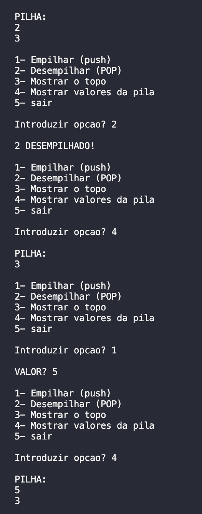

<h1 align="center">
    
</h1>

Trabalho em C

Funcionamento de uma Pilha LIFO(Last In First Out) 
    
Programa em linguagem C padrão, de nome pilha.c, que permita efetuar o teste de um programa.
O programa recebe valores inteiros, e permite empilar e desempilar e mostra os valores na ordem que vão ficando:

📌 Programa sobre # Pilha
Funcionamento de uma Pilha LIFO(Last In First Out)
------------------

## Sintaxe para compilar:

<pre>gcc pilha.c -o pila </pre>

## Sintaxe para executar:
<pre>./pilha </pre>

O projeto foi feito em C.

The project was done with C.

🔧 Tecnologias utilizadas:
------------------

- C 

💬 Fale comigo
------------------
[*Entre em contato comigo*](https://www.linkedin.com/in/ivo-baptista-3712144/)

